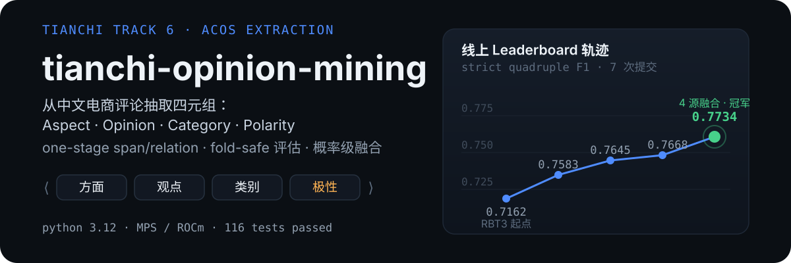
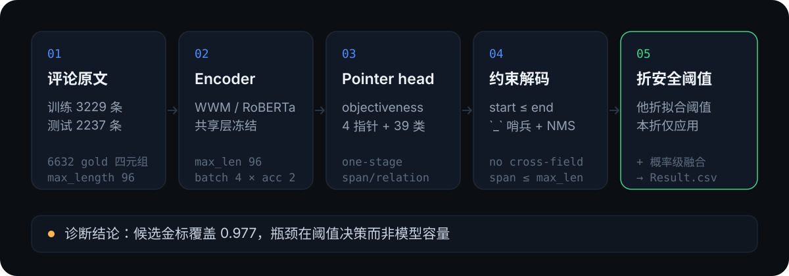
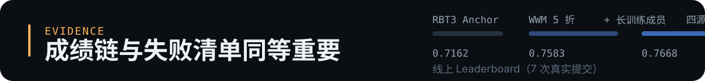

<p align="center">
  
</p>

<p align="center">
  
  
  
  
  
</p>

从中文电商评论中抽取四元组 **(Aspect, Opinion, Category, Polarity)**，评分口径是**严格四元组 micro-F1**：四个字段全部命中才算一条正确，不接受任何部分匹配。

本仓库不是代码片段合集，而是一条**有完整证据链的研究记录**：one-stage span/relation 模型、fold-safe 评估协议、逐项隔离的消融实验、概率级融合，以及把线上成绩从 **0.7162 推到 0.7734** 的全部中间提交（含失败实验与负结果）。

---

## 成绩

线上链路（每次提交只改一个变量，全部为真实 Leaderboard 分数）：

| 阶段 | 配置 | 本地（无泄漏交叉拟合） | 线上 LB |
| --- | --- | ---: | ---: |
| 历史 Anchor | `hfl/rbt3` one-stage span/relation，5 折 | 0.7209 | 0.7162 |
| ① 换强 encoder | `hfl/chinese-roberta-wwm-ext` 5 折 × 4 轮 | 0.7543 | 0.7583 |
| ② + 长训练成员 | WWM 5 折 + WWM 3 折 × 8 轮（1 : 0.7） | 0.7693 | 0.7645 |
| ③ + 多样性成员 | 再加 MacBERT 5 折（1 : 0.7 : 0.3） | 0.7682 | 0.7668 |
| ④ **四源融合（最终冠军）** | WWM 5×10 轮 + WWM 3×8 轮 + WWM 5×4 轮 + MacBERT 5（1 : 0.7 : 0.4 : 0.3） | 0.7768 | **0.7734** |
| ⑤ 备用权重 | 同四源，权重 1 : 1 : 0.5 : 0.4 | 0.7753 | 0.7702 |
| 单模型试投 | WWM 5×10 轮 / WWM 3×8 轮 | 0.7731 / 0.7637 | 0.7633 / 0.7559 |

要点：**线上分低于本地交叉拟合分（−0.0014 ~ −0.0048）是系统性的**，所以本仓库用本地无泄漏分做筛选门禁，但任何一次替换都以上线实测为准。

---

## 方法

<p align="center">
  
</p>

<p align="center">
  
</p>

三条硬约束决定了所有实验的合法性：

1. **折安全（fold-safe）**：阈值与融合权重只在**其他折**上拟合，被评分的那一折只做应用。任何"在评估折上调阈值"的分数在本仓库一律标记为 `in_sample_reference_not_strict`，不得用于晋级。
2. **单一变量**：每个实验只允许改一个配置项，配套 `keep_gate`（要求 ΔF1 ≥ 0.004）判定是否保留。
3. **候选与决策分离**：模型只负责产出候选集合，是否输出由阈值/融合决策层决定。WWM 候选的**金标覆盖已达 0.9772**（完美排序上限 F1 0.9885），而阈值决策只做到 0.754 —— 瓶颈在决策层，不在模型容量。

---

## 快速开始

```bash
git clone https://github.com/37chengshan/tianchi-opinion-mining.git
cd tianchi-opinion-mining
export PYTHONPATH=src

# 测试（无需数据、无需 GPU）
python3 -m pytest -q            # 123 passed, 3 skipped

# 获取主干权重（默认走阿里云魔搭 ModelScope，国内直连）
python3 scripts/fetch_model.py --model hfl/rbt3 --out models/rbt3
python3 scripts/fetch_model.py --model hfl/chinese-roberta-wwm-ext --out models/wwm

# 训练 + 严格评估 + 出提交（数据放到 artifacts/data/）
python3 scripts/run_anchor.py --config configs/anchor_wwm_5fold.json
python3 scripts/build_submission.py --experiment anchor_wwm_5fold
```

评测与提交都走同一套严格口径：`src/opinion_mining/metrics.py`（四元组精确匹配）+ `scripts/build_submission.py`（行数、空 id、SHA256 校验）。

---

## 关键实验

<p align="center">
  
</p>

### 假设 → 证据

| 假设 | 实测 | 结论 |
| --- | --- | --- |
| 模型欠训练 | 4 轮时每折监控 F1 **仍在上升**；改 8/10 轮 + lr 2e-5 → 1.2e-5，同折 F1 0.7564 → **0.7731**（单模型 +0.017） | 成立，已并入主线 |
| 换强中文 encoder 是最大单项收益 | RBT3 → WWM：本地 0.7209 → 0.7543（+0.0334），线上 0.7162 → **0.7583** | 成立 |
| 多样性 > 本地微差 | 本地低 0.0011 的三源融合（加 MacBERT），线上反而 **+0.0023** | 成立，融合按"异构"而非"最强"选成员 |
| 决策层是瓶颈 | 候选金标覆盖 0.9772 / 完美排序上限 0.9885，实际阈值决策 0.754 | 成立，指导后续 RAG/verifier 只做长尾补召 |

### 消融（3 折、固定折、同参、单变量）

| 实验 | 严格 F1 | Δ vs 基线 | 门禁（≥0.004） |
| --- | ---: | ---: | --- |
| 历史基线 `hfl/rbt3` | 0.6874 | — | — |
| B1 官方 offsets | **0.7140** | +0.0266 | 通过 |
| B2 implicit-O 哨兵 | 0.7116 | +0.0241 | 通过（implicit-O 召回 0.0000 → **0.3547**） |
| B3 多关系保留 | 0.7064 | +0.0189 | 通过 |
| v1 = B1+B2+B3 组合 | 0.7140 | +0.0266 | 组合无叠加增益（= B1 单独） |

结论：三项修复单独都过门禁，但组合后**严格等于 B1 单独结果**，说明增益集中在 offsets 与解码一致性上。

### 失败清单（同等重要）

| 路线 | 结果 | 处理 |
| --- | --- | --- |
| dense Grid V2 + pair filter 融合 | 无泄漏交叉拟合 **0.6337**（远低于 one-stage 0.75+） | 整条路线淘汰，不再作为主线 |
| OpinioNet-style 结构增强（RBT3 控制组） | 0.7088 vs 0.7140 | 未过 −0.002 门禁，不进主线 |
| 本地 4-bit QLoRA（Qwen3-4B，MLX） | fold-1 0.6417 vs BERT 0.7442 | 量化 + 短训不足，降级为次优先 |
| 加大 `max_length` | 最长评论仅 72 token，96 无截断损失 | 不是瓶颈 |
| reranker 路线（BM25/prior 重排） | 0.7180 ~ 0.7527，未超过同参数 one-stage | 未进入提交候选 |

---

## 阿里云链路

本项目在阿里云生态内完成，以下为**实跑记录**（不是兼容性声明）：

- **天池平台**：全部线上分数来自天池评测系统的真实提交（7 次提交，0.7162 → 0.7734），提交文件与 SHA256 全部归档在 `artifacts/submissions/`。
- **魔搭 ModelScope（阿里云）**：主干权重通过魔搭获取，`scripts/fetch_model.py --source modelscope` 内置 `hfl/rbt3`、`hfl/chinese-roberta-wwm-ext` 的魔搭镜像映射，并与 Hugging Face 路线共享同一套训练代码。
- **通义千问 Qwen3-4B（阿里云开源模型）微调实验**：用 QLoRA（MLX 4-bit）在本赛题数据上做了 fold-1 严格评测 —— 逐 epoch 2 epochs / 2152 iters，输出严格 JSON（含 implicit-O 哨兵），**解析失败 0**，严格 F1 **0.6417**（P 0.6688 / R 0.6167，1077 条验证、2023 条预测、2194 条金标）。结论：本地量化 + 短训条件下 LLM 直抽打不过同等数据的 BERT 集成，因此 Qwen 在本方案中的角色被限定为**长尾/隐式样本的 verifier 与 challenger**，不作为主模型。
- **PAI-DSW 云端复现路径**（兼容性说明，非本机实跑）：本仓库的训练脚本为纯 PyTorch，可直接在 PAI-DSW Notebook 中以相同命令、相同 fold 划分运行；云端 bf16 LoRA 配方（`run_cloud_lora.yaml`，对齐同赛题公开方案 Qwen3-4B 0.75 / Qwen2.5-7B 0.78 / 32B 0.81 档）与打包脚本 `scripts/make_cloud_bundle.sh` 已随仓库提供。

---

## 仓库结构

```text
src/opinion_mining/     核心库：数据、模型、严格指标、折安全评估、融合
scripts/                训练 / 评估 / 提交 / 模型获取 / 云端打包
tests/                  123 个测试（含复现、门禁、提交契约）
artifacts/champions/    冻结的线上冠军（manifest + 提交 SHA256）
artifacts/submissions/  全部候选提交 + 成绩记录（manifest.csv / queue.json）
artifacts/experiments/  消融、融合、LLM 实验的报告与分数
assets/readme/          README 视觉资产（纯 SVG）
docs/                   方案、计划、实验历史、云端训练方案
dashboard/              本地监控（监控 / 数据 / 关于）
```

## 文档

- `docs/experiment-history-2026-09-29.md` —— 逐次提交与关键发现的完整时间线
- `docs/cloud-training-plan-2026-09-29.md` —— 云端 GPU 路线与成本/预期对照
- `docs/superpowers/plans/2026-09-28-anchor-to-0.8-plan.md` —— 冲 0.80 的研究方案

## 数据与许可

- **不包含**赛题数据（`artifacts/data/` 已排除，见 `.gitignore`）；请从比赛页面获取后放入该目录；
- **不包含**模型权重与中间候选产物（可按下文命令重训重建），也不含任何密钥/令牌；
- `artifacts/submissions/candidates/**/Result.csv` 为本项目自有产出，仅用于复现与说明；
- 代码与文档采用 MIT；赛题数据版权归原赛事方所有。
